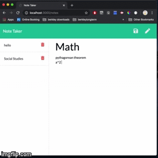

# note-taker
Take notes, and never lose them

# links
> [GitHub Repository](https://github.com/boundsalexis/note-taker)
> [live link](https://mysterious-waters-03191.herokuapp.com/notes)

## Images


# Technologies Used
> Node JS 
> FS to write files
> Path for working with files
> CSS to style the output html


# Summary
AS A user, I want to be able to write and save notes
I WANT to be able to delete notes I've written before
SO THAT I can organize my thoughts and keep track of tasks I need to complete

# Code Snippet
``` javascript
 app.post("/api/notes", function (req, res) {
        // reads our database file
        fs.readFile(path.join(__dirname, "../../db/db.json"), "utf-8", function (err, data) {
            // turns into object
            let database = JSON.parse(data);

            // pushed new note into database
            database.push(req.body);
            // adds unique id every time new note is added
            for (let i = 0; i < database.length; i++) {
                database[i].id = i;
            }
            // rewrites our database file with the new info
            fs.writeFile(path.join(__dirname, "../../db/db.json"), JSON.stringify(database), function (err) {
                if (err) throw err;
            });

        });
    })
```
> This is how we ensure each note always has a unqie id
> New note gets added
> Every element in database array gets id attribute rewritten or added in the case of the new note
> This is how we ensure when we delete a note we are deleting the right one

# Upgrades
> Adding folders to organize the notes


## Authors

* **Alexis Bounds** 

- [Link to Portfolio Site](https://github.com/boundsalexis/basic-portfolio)
- [Link to Github](https://github.com/boundsalexis)
- [Link to LinkedIn](https://www.linkedin.com/in/alexis-bounds-9b7711169/)